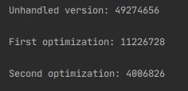

# Loop optimization

### Initial code (#4)

``` java
    private static void unhandled() {
        long start = System.nanoTime();
        int[] C = new int[2];
        int res = 0;
        for (int j = 500000000; j > 0; j--) {
            C[0]++;
            C[0]++;
        }
        C[1] = C[0];
        System.out.println(C[0]);
        System.out.println("Unhandled version: " + (System.nanoTime() - start));
    }
```

### First optimization 
In Java, reference-type objects are stored in the so-called **Heap** memory, while primitive types (`int`, `double`, `long`, etc.) are stored in the **Stack** memory.
**Heap** memory has more volume, but less efficiency than **Stack** memory, since it requires more time to access an object. Despite the fact that
our array stores `int` values, it is still an object, therefore it is located in **Heap** memory. We can avoid accessing **Heap** during every iteration of the loop by 
introducing a local variable of primitive type `int`, and update it instead, and assigning its value to an array cell.

``` java
    private static void optimizationOne() {
        long start = System.nanoTime();
        int[] C = new int[2];
        int res = 0;
        for (int j = 500000000; j > 0; j--) {
            res++;
            res++;
        }
        C[1] = C[0] = res;
        System.out.println(C[0]);
        System.out.println("First optimization: " + (System.nanoTime() - start));
    }
```

### Second optimization
**Stack** memory is a lot faster than **Heap** memory, but it still requires some time to access a specific area of the memory.
We could avoid duplicating our operations and referencing the same variable twice just by incrementing it by `2` at every iteration.

``` java
    private static void optimizationTwo() {
        long start = System.nanoTime();
        int[] C = new int[2];
        int res = 0;
        for (int j = 500000000; j > 0; j--) {
            res += 2;
        }
        C[1] = C[0] = res;
        System.out.println(C[0]);
        System.out.println("Second optimization: " + (System.nanoTime() - start));
    }
```
### Time measurements 
 